# User Events Analysis

## 1. Project Overview
This project builds an automated, event-driven data pipeline on AWS using a **7-days (19/09/2026 - 25/09/2026) simulated dataset that replicates real-world e-commerce user activity**. The pipeline instantly captures, cleans, and optimizes these user-interaction events as they happen, moving the data seamlessly from raw files to analytics-ready tables.

## 2. Problem it works on:
Traditional data pipelines process data in slow, rigid batches instead of real time. Furthermore, without immediate quality checks, corrupted or malformed data easily flows into final tables, ruining reports and slowing down business decision-making.

## 3. Aim
- Automate Ingestion: Trigger processing instantly via AWS Lambda as soon as data lands in Amazon S3.

- Ensure Quality: Block bad or corrupted records immediately using Great Expectations (GEX) validation.

- ACID Compliance & Reliability: Utilize Apache Iceberg tables partitioned by date to guarantee transactional consistency, schema evolution, and fast querying.

- Simplify Analytics: Expose clean data directly to analysts through AWS Glue Data Catalog and Amazon Athena.

## 4. Core System Qualities: 
1. **Idempotency**: Implemented using the Apache Iceberg table format, ensuring that if a PySpark job retries or processes the same batch twice, it avoids duplicate data appends and maintains atomic commit consistency.
2. **Decoupled Scalability**: Separating infrastructure state (Terraform), ingestion routing (AWS Lambda), and data compute tasks (AWS Glue) prevents processing bottlenecks during sudden user-traffic surges.
3. **Fault-Tolerant Observability**: Built-in programmatic exception catching using custom Python logging dumps stack traces directly into Amazon CloudWatch, making the system fully auditable.
4. **Late Data Handling (Out-of-Order Processing)**: Leverages Apache Iceberg’s row-level transactional updates. When delayed e-commerce interaction logs arrive, the Silver script handles row-level deduplication using the event_id, while the Gold scripts execute transactional upserts or merges directly matching your analytical grain (Day, Product ID, and Country). This ensures historical metrics are updated accurately without causing duplicate entries or requiring full partition rewrites.

## 5. Architecture Overview

The project follows an event-driven data pipeline architecture, with S3 buckets and IAM security configurations provisioned via **Terraform**. The data flow operates through the following decoupled steps:

1. **Event Trigger:** The arrival of **JSON data** in the **Amazon S3 Raw/Bronze bucket** automatically generates an object-created notification.

2. **Orchestration Bridge:** An **AWS Lambda** function intercepts the S3 notification and safely bridges file metadata to kick off the pipeline stages.

3. **Data Transformation & Validation Pipeline:** The AWS Glue Workflow orchestrates sequential PySpark ETL jobs to process data through Bronze, Silver, and Gold layers:

    - **Great Expectations (GEX):** Programmatically validates incoming schemas and structural rules to ensure data quality before writing downstream.

    - **Apache Iceberg:** Persists data in the **S3 Silver and Gold buckets** using the Iceberg table format, optimized with date-based partitioning for transactional consistency.

4. **Metadata & Analytics Presentation:** The **AWS Glue Data Catalog** acts as the central schema repository, dynamically synchronizing table layouts so Data Analysts and Data Scientists can execute high-performance, ad-hoc SQL queries using **Amazon Athena**.

5. **Continuous Observability & Monitoring Layer**: **Amazon CloudWatch** acts as the central telemetry backbone for the entire pipeline. It provides:
    
    - **Centralized Logging**: Collects execution logs from the AWS Lambda function and real-time print/error outputs from the PySpark ETL jobs inside AWS Glue.
    
    - **Pipeline Metrics & Alerts**: Monitors processing durations, workflow failures, and Athena query runtimes, enabling proactive operational troubleshooting.

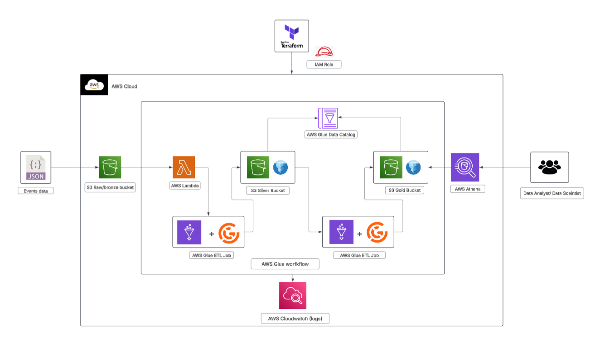

## 6. Steps to follow
1. Data generation 
    - A custom python simulation script was developed to mimic an e-commerce platform's live clickstream traffic.
    - The script provides 2 options for data generation one generating current dates data and another generating past 10 days data.
    - To refer the code you can go to [data_generator](./data_generator/) section 
    - The Output is Semi-structured JSON records generated in following format.
    - For this project I created S3 bucket using terraform below and then created prefix bronze and added the data one by one after completion of each workflow. 
```json
{
    "event_id":"EVTADF84D25F865",
    "user_id":"U004991",
    "session_id":"S2DDEBEE355",
    "event_timestamp":"2026-09-15T04:16:49",
    "ingestion_timestamp":"2026-09-15T04:20:11",
    "event_type":"product_view",
    "product_id":"P0220",
    "device_type":"tablet",
    "platform":"ios",
    "traffic_source":"organic",
    "country":"India"
}
```
2. AWS account and user creation:
    - To deploy and test this data pipeline project, you can set up a new [AWS Free Tier Account](https://aws.amazon.com/free/), which provides 12 months of free access to core cloud services up to specific monthly usage limits.
    - How to Sign Up:
        1. Visit the Registration Portal: Navigate directly to the official AWS Free Tier Page.
        2. Create a Login: Click the "Create a Free Account" button and enter your email address and a secure password.
        3. Contact & Identity Verification: Provide your basic contact information and input a valid credit or debit card.
        Note: AWS charges a temporary authorization fee (typically $1 or equivalent currency) to verify identity, which is refunded immediately.Complete 
        4. Phone Verification: Confirm your identity via an automated text message or phone call code validation.
        5. Select Your Support Plan: Choose the "Basic Support – Free" option to complete registration.Your account will be activated shortly after completion, allowing you to safely deploy your Terraform components, Lambda triggers, and Glue workflows within the safe limits of the free tier landscape.
    - Also I have used user account not root account to create one you can follow below steps or visit [Creating an IAM user in your AWS account](https://docs.aws.amazon.com/IAM/latest/UserGuide/id_users_create.html):  
        1. Access the Dashboard: Sign in to your cloud console and navigate directly to the AWS IAM Console.
        2. Add a User: Select Users from the left navigation pane and click the Create user button.
        3. Configure Identity: Specify a unique username and check the box to grant AWS Management Console access if they need visual dashboard access.
        4. Set Permissions: Choose Attach policies directly and select standard managed rules (like AmazonS3FullAccess or AWSGlueConsoleFullAccess). I have used for this project - AdministratorAccess.
        5. Download Credentials: Review your configuration, click Create user, and immediately download the CSV file containing the new Access Key ID and Secret Access Key before closing the window

3. Terraform
    - Terraform is Infrastructure as a code service.
    - I have used this to create AWS S3 bucket and IAM roles for AWS lambda to access S3 bucket, cloudwatch and glue workflow and for glue service to access S3 bucket and cloudwatch.
    - To refer the code you can go to [terraform_aws](./terraform_aws/) section.
    - I have provided AWS creds by adding [aws access key](https://docs.aws.amazon.com/keyspaces/latest/devguide/create.keypair.html) to [aws command line tool](https://docs.aws.amazon.com/cli/latest/userguide/getting-started-install.html) in my local system.
    - You can also see I have provided variables by creatiing variable.tf file which I have not added as it containes private details, to refer how to create you can click - [create_variable_file](https://developer.hashicorp.com/terraform/language/values/variables)
    - To run the code you need to initialize terraform using you code editor terminal type `terraform init` to your code path, if you have properly added your aws creds then it would be initialzed.
    - Then to check your code before running `terraform plan`, you need to view your plan.
    - Lastly to run the code, `terraform apply` and it would ask your permission before executing the type `yes`.
4. AWS Lambda Code
    - On search bar at top of your AWS console type AWS lambda service and click on the lambda search result.
    - Click on Create Function at the top left.
    - Select Author from Scratch, name your function and select latest python version as your Runtime.
    - In additional settings select ARM64 architecture and also select Custom execution role in that select latest lambda role we created using teraform.
    - You need to write the code that trigger glue workflow whenever new S3 data is added, you refer the code in this section [aws lambda code](./scripts/aws_lambda_code/)
    - After adding the code you also need to **add trigger** at the top section in the diagram section and provide S3 as option, add bucket url and in prefix section select **bronze** and save.
    - The diagram would have S3 connected to lambda function.

5. AWS Glue Workflow
    - This section outlines the actual execution workflow inside AWS to bind the individual PySpark scripts together into an automated pipeline.
    - Follow these steps within the AWS Management Console to orchestrate your data pipeline nodes and execution conditions:
    - On the search bar at the top of AWS console, type AWS Glue and click on the glue search result.
    - In the left navigation pane under the Data Catalog section, click on Databases, select Add database, enter the exact database name configured in the scripts, and click Create database.
    - To refer the script you can go to [scripts](./scripts/) section which has [transformation scripts](./scripts/data_transformation_layer/) and [analytics scripts](./scripts/data_analytics_layer/).
    - Navigate to your Amazon S3 console, locate your deployment scripts bucket, create libraries prefix and under that I had added [user_events_function](./scripts/user_events_function/) folder in zip format having great expectation function script.
    - Return to the **AWS Glue console**, click on ETL jobs under the Data Integration and ETL sidebar, select Spark script editor, paste your code and in the Job detail section choose the IAM execution role created by Terraform.
    - Requested number of worker update to 2, in Advanced properties section add **Job parameters** as given below:
        - Key: --datalake-formats | Value: iceberg (This tells AWS Glue to natively activate the Apache Iceberg runtime framework).
        - Key: --conf | Value: spark.sql.catalog.glue_iceberg.glue.skip-name-validation=true --conf spark.sql.catalog.glue_catalog.glue.skip-name-validation=true    
        - Key: --additional-python-modules | Value: great_expectations.
        - Key: --S3_OUTPUT_PATH | Value: (The target destination S3 bucket path for either the Silver or Gold)
    - Also under python library path add the S3 bucket full link having user_events_function.zip 
    - Repeat this step to create 5 individual job nodes (1 Silver job and 4 Gold jobs).
    - In the left navigation pane under Data Integration and ETL, click on Workflows and select Add workflow at the top right.
    - Name your workflow (e.g., ecommerce-event-pipeline), leave the default properties, and click Add workflow at the bottom to initialize the master container.
    - Click on your newly created workflow name from the list, scroll down to the visual graph section, and click on Add trigger at the center of the canvas.
    - Choose Add new, name your trigger (e.g., Start_Trigger), set the trigger type to Event / On-Demand (to allow your AWS Lambda function to invoke it dynamically with parameters), and click Add.
    - Click on the node icon representing your new Start_Trigger in the graph, click Add node / job, check the box next to your Silver PySpark ETL job, and click Add to bind it as the first processing step.
    - Click directly on your Silver Job node in the graph, click Add trigger, select Add new, name this conditional trigger (e.g., Silver_Success_Trigger), set the trigger type to Conditional, select the condition All watched jobs succeeded, and click Add.
    - Click on this newly created Silver_Success_Trigger node in the visual mapper, click Add node / job, check the boxes next to all 4 Gold PySpark ETL jobs, and click Add to configure them to execute concurrently the moment the Silver table transaction successfully commits.
    - Verify your complete pipeline layout in the visual chart to confirm the operational flow runs sequentially from S3 Event ➔ Lambda ➔ Start Trigger ➔ Silver Job ➔ Success Trigger ➔ 4 Gold Jobs (running in parallel).
    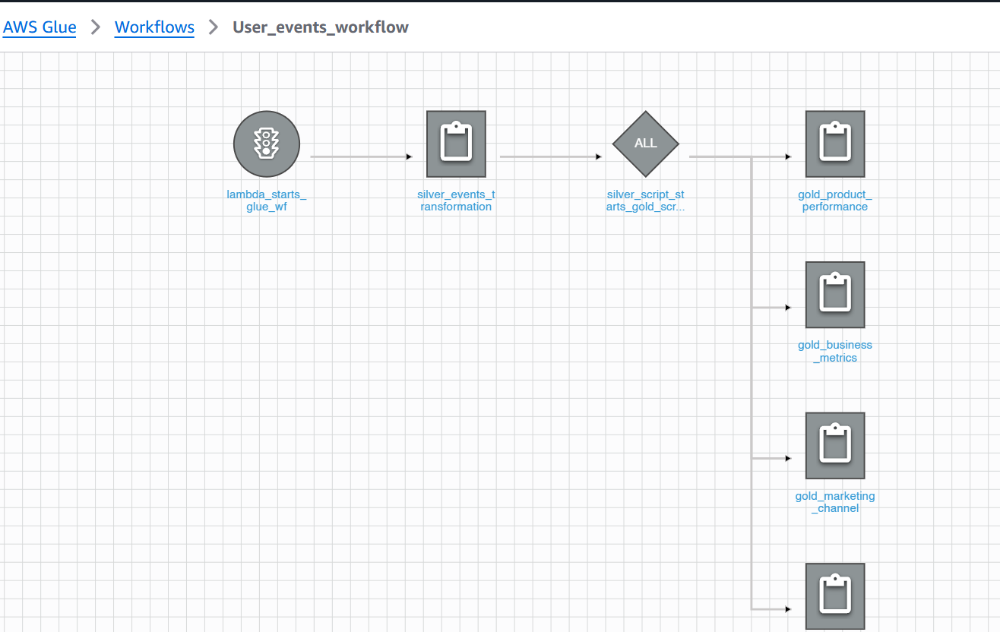

## 7. Pipeline in Action (End-to-End Walkthrough)
1. For this project I added data of date - 19/0/2026 first in S3 bucket.
2. Adding this data triggers lambda which in turn triggers glue workflow, you can monitor the lambda script using cloudwatch logs under Monitor section.
3. Now, in AWS glue you can monitor your data transformation and data analytics scripts, by clicking on the specific job and under the run section at the bottom clickon the output log which willl redirect to cloudwatch log section.
- Image for glue job run details 
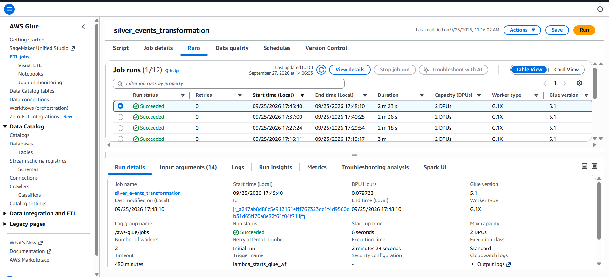

- Image for glue job logs by clicking on output log section
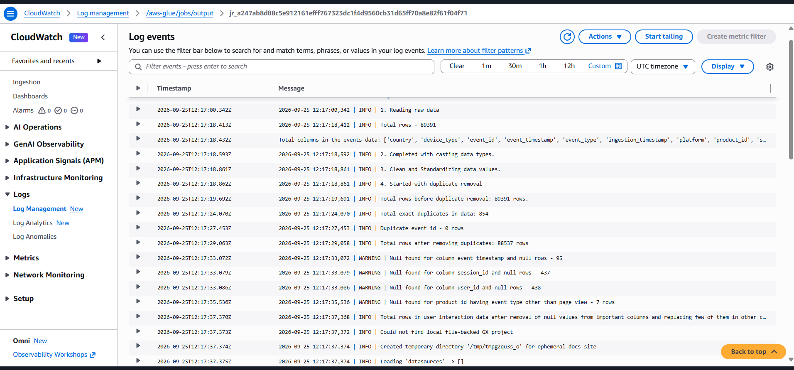

4. After completion of the job data is added to S3, which is ready to be queried by AWS athena.


## 8. Querying Data Using AWS Athena
- We have both silver data and gold data of past 7 days available (25/09/2026 - 19/09/2026) for data analyst/data sceintist for querying.
- Lets query our gold data table to find answers to the following question 
1. Based on Product Performance (grain: event_date, country, product_id).        
    1.1. Which 10 products had the highest number of purchases?   
    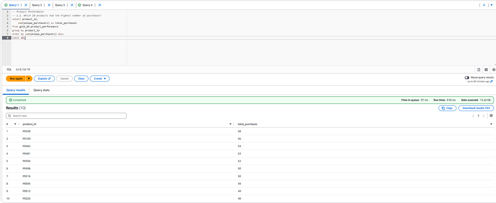

    1.2. Which product achieved the highest purchase rate in a given day?
    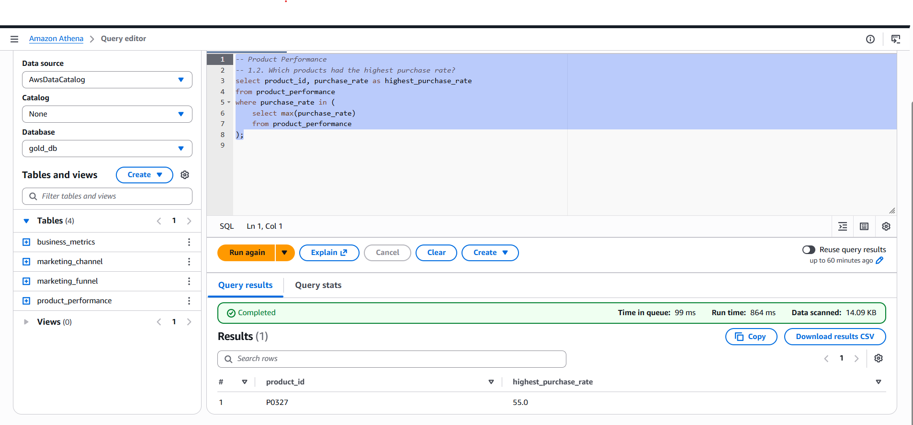

    1.3. Which products had high views but comparatively low purchases?  
    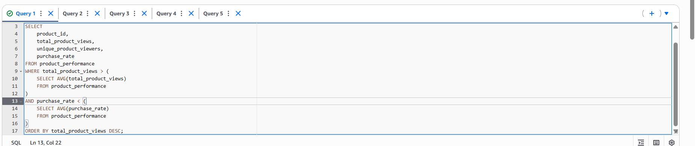 

    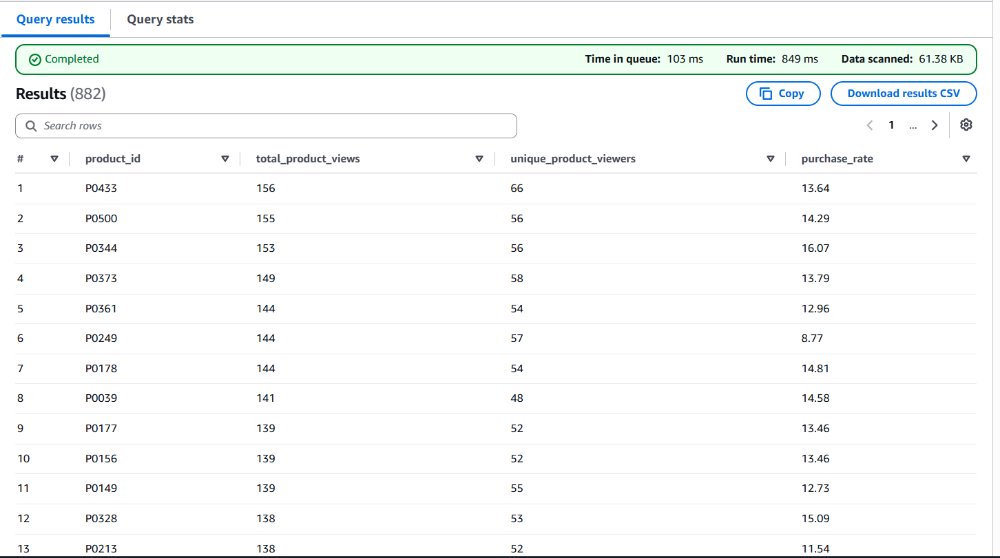        

2. Based on Marketing channel (grain: event_date, country, traffic_source)   
    2.1. Which traffic sources generated the highest number of users?
    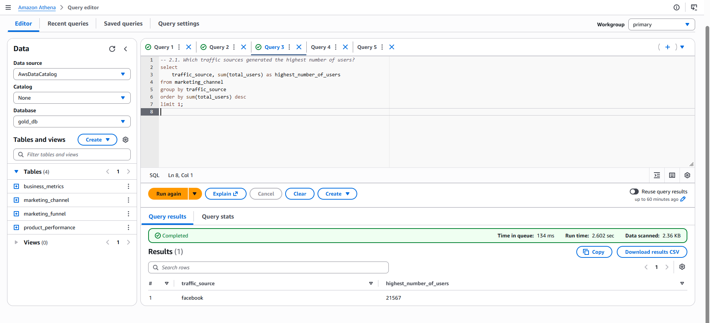

    2.2. Which traffic sources generated the highest number of purchases?
    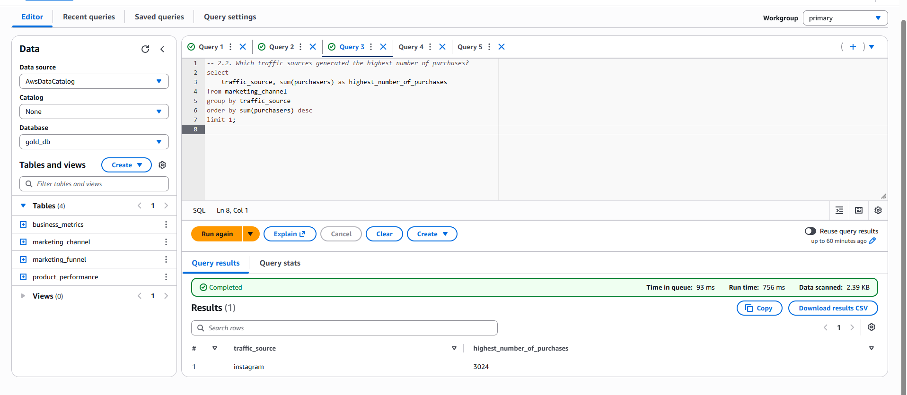

    2.3. Which traffic source generated the highest number of sessions overall?
    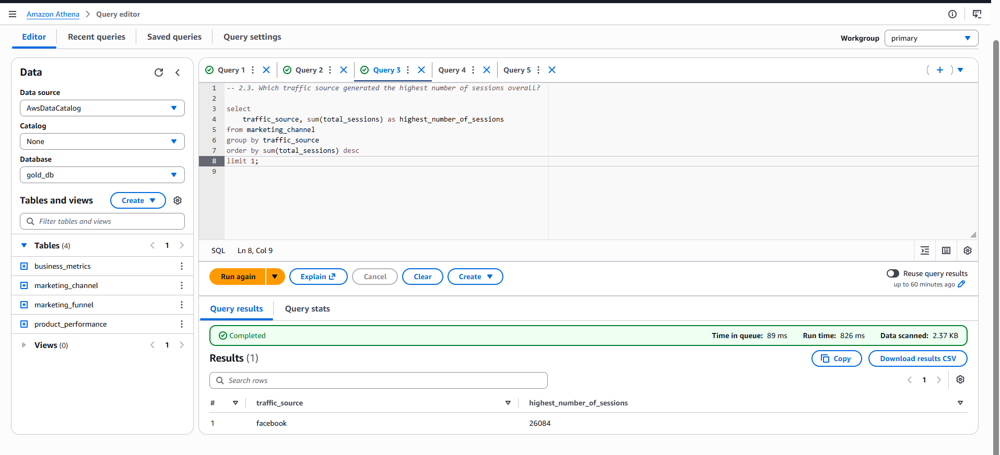

3. Based on Marketing funnel (grain: event_date, coutry_id)   
    3.1. How many users progressed through each stage of the marketing funnel each day?
    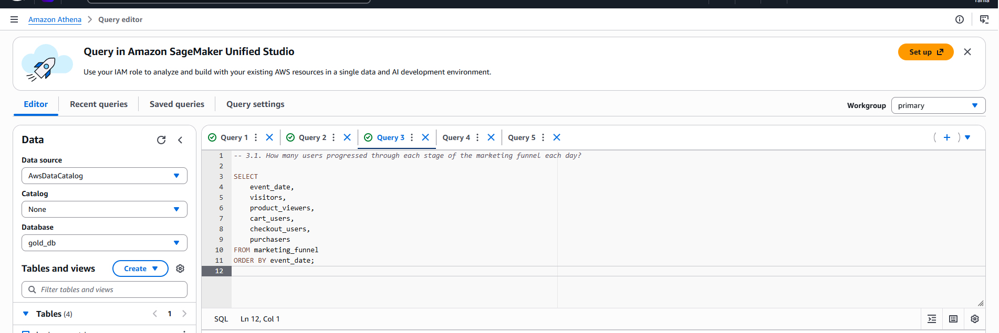

    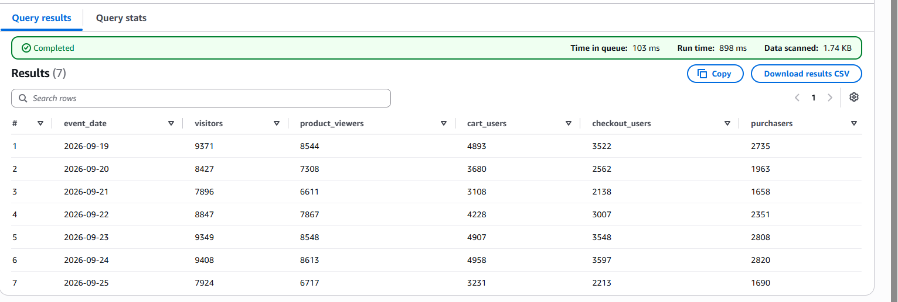
    
    3.2. What was the conversion rate at each stage of the funnel each day?
    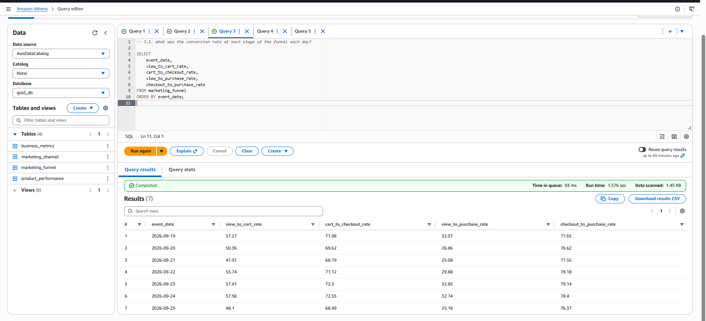

4. Based on Business metrics (grain: event_date, coutry_id)  
    4.1. Which days had the highest number of purchasers?
    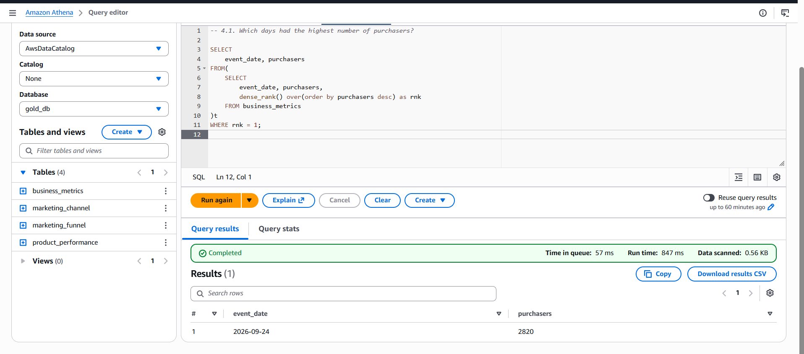


